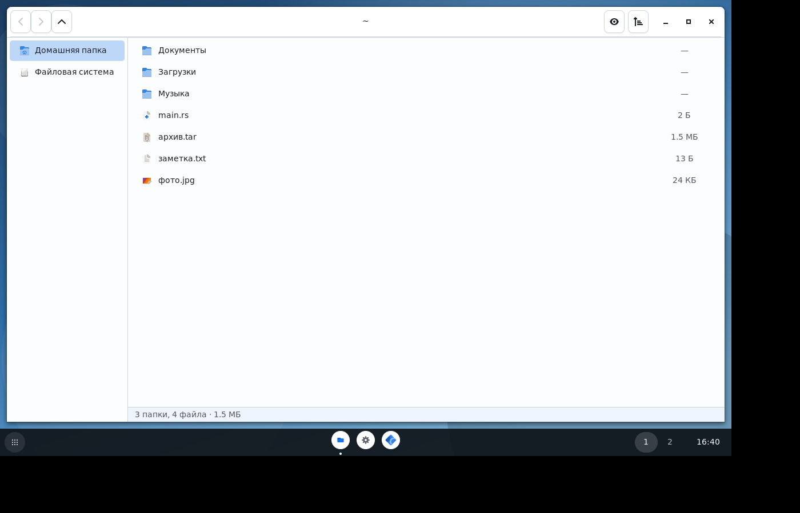
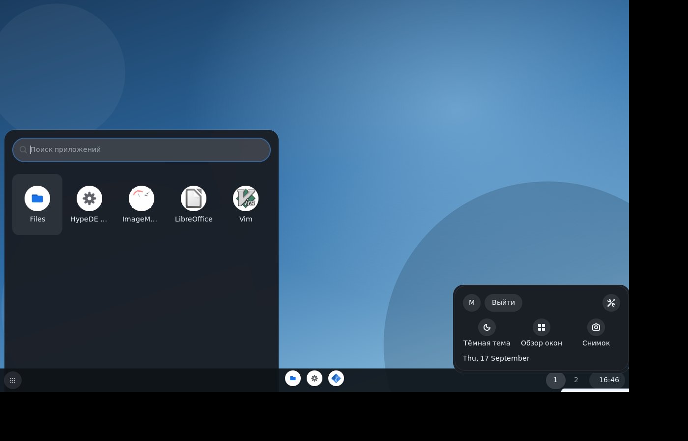
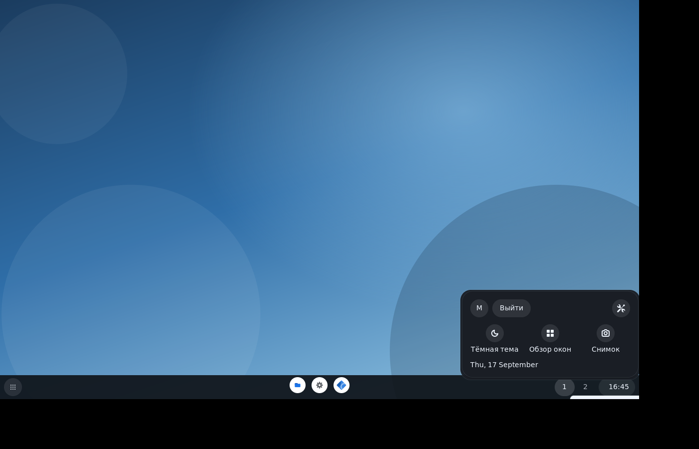
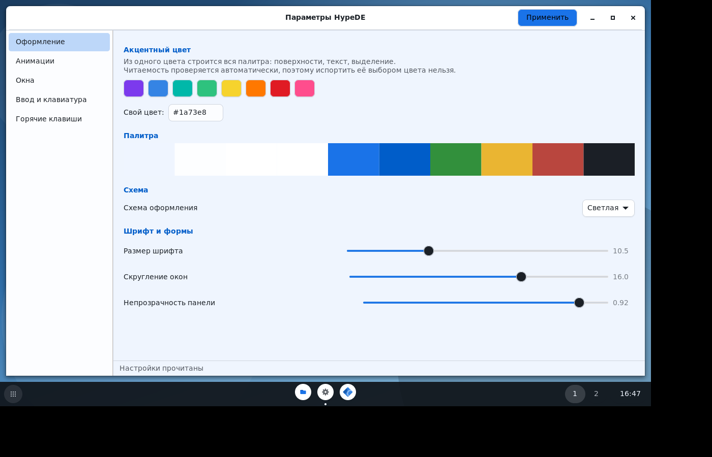
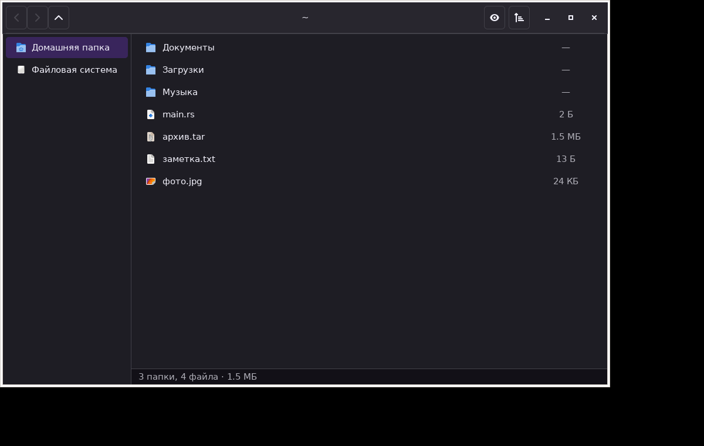

<p align="center">
  
</p>

<p align="center">
  <b>Среда рабочего стола для CachyOS и других дистрибутивов на Wayland.</b><br>
  Свой композитор, полка, файловый менеджер, настройки и анимации — на Rust.<br>
  Минималистичный облик в духе Chrome OS: тёмная полка поверх обоев, светлые окна.
</p>

---

## Что это

HypeDE — не тема и не набор надстроек над чужой средой. Это собственный
композитор Wayland со своей раскладкой окон, своим движком анимаций, своей
цветовой системой и своими приложениями.

Версия 0.2 — среда собирается, запускается на настоящем железе и годится для
работы. Часть возможностей ещё впереди, и они честно перечислены в
[дорожной карте](docs/ДОРОЖНАЯ-КАРТА.md).

Облик вдохновлён Chrome OS: полка внизу с круглыми значками, поиск приложений
из левого нижнего угла, панель быстрых настроек, спокойная светлая тема окон.
Все значки, обои и звуки — **оригинальные**: ассеты Google проприетарны, и в
проекте их нет.

<p align="center">
  
</p>

## Что уже работает

| Часть | Состояние |
|---|---|
| Композитор Wayland | окна, фокус, плиточная раскладка, 9 рабочих столов, горячие клавиши, меню и всплывающие панели |
| Запуск на железе | бэкенд DRM/KMS: несколько мониторов, подключение на ходу, переключение консолей |
| Обои | свои изображения с режимами «заполнить», «вписать», «по центру» |
| Анимации | пружины и кривые Безье, перенацеливание на лету без рывков |
| Тема | вся палитра строится из одного акцентного цвета, читаемость проверяется автоматически |
| Полка | круглые значки, отметка запущенного, рабочие столы, часы, батарея |
| Панель состояния | выход, параметры, смена схемы, обзор, снимок, громкость |
| Файловый менеджер | навигация, сортировка, скрытые файлы, боковая панель |
| Настройки | оформление, анимации, окна, ввод — с применением на лету |
| Поиск приложений | сетка значков, разбор `.desktop`, поиск по имени, описанию и ключевым словам |
| Звуки | оригинальный набор: вход, уведомление, громкость, ошибка, выход |
| `hypectl` | управление и события из терминала и скриптов |

Всё это покрыто **339 тестами** — от математики пружин до склонения русских
числительных на полке.

<p align="center">
  
  
  
  
</p>

## Быстрый старт

```bash
git clone https://github.com/RBXLU/devHypeDE
cd devHypeDE
cargo build --release
```

Запуск вложенным окном прямо из текущего сеанса — так удобно пробовать, ничего
не ломая:

```bash
./target/release/hypede-comp --winit
```

Запуск настоящим сеансом из консоли (Ctrl+Alt+F3, вход, затем):

```bash
./target/release/hypede-comp --drm
```

Без аргументов бэкенд выбирается сам.

Подробности, зависимости и установка пакетом — в
[СБОРКА-И-ЗАПУСК.md](docs/СБОРКА-И-ЗАПУСК.md).

## Горячие клавиши по умолчанию

| Сочетание | Действие |
|---|---|
| `Super+Return` | терминал |
| `Super+E` | файлы |
| `Super+I` | параметры |
| `Super+Space` | поиск приложений |
| `Super+Q` | закрыть окно |
| `Super+F` | во весь экран |
| `Super+←↑↓→` или `Super+HJKL` | перевести фокус |
| `Super+Shift+←↑↓→` | переставить окно |
| `Super+1…9` | рабочий стол |
| `Super+Shift+1…9` | окно на рабочий стол |
| `Super+Shift+E` | завершить сеанс |

Сочетания работают в любой раскладке: композитор смотрит на латинский символ
клавиши, а не на набранный.

## Настройка

Полный перечень — в [НАСТРОЙКА.md](docs/НАСТРОЙКА.md). Всё живёт в одном файле
`~/.config/hypede/config.toml`. Файла может не быть —
среда запустится со значениями по умолчанию. Менять можно как файл, так и
приложение «Параметры».

```toml
[theme]
accent = "#2ec27e"        # из него строится вся палитра
variant = "light"         # схема окон
shell_variant = "dark"    # схема полки

[wallpaper]
path = "/home/имя/Изображения/моё.png"

[panel]
position = "bottom"
pinned = ["dev.hypede.Files", "firefox", "foot"]

[[keybind]]
keys = "Super+B"
do = "spawn"
command = "firefox"
```

## Из чего состоит

```
crates/
  hype-anim            движок анимаций: кривые, пружины, перенацеливание
  hype-theme           цвет (OKLCH), палитра из акцента, выгрузка в CSS
  hype-config          config.toml, горячие клавиши, пути XDG
  hype-ipc             протокол управления + утилита hypectl
  hypede-compositor    композитор: раскладка, рабочие столы, ввод
  hypede-shell         панель и поиск приложений
  hypede-files         файловый менеджер
  hypede-settings      параметры среды
```

Подробнее — в [АРХИТЕКТУРЕ](docs/АРХИТЕКТУРА.md).

## Установка пакетом и публикация

```bash
makepkg -si
```

Как выложить в AUR и как сделать свой репозиторий pacman —
[ПАКЕТ-И-РЕПОЗИТОРИЙ.md](docs/ПАКЕТ-И-РЕПОЗИТОРИЙ.md).

## Не знаете Rust?

Это не помеха. Есть [разбор кодовой базы для начинающих](docs/RUST-С-НУЛЯ.md):
он идёт от простого к сложному прямо по файлам этого проекта и объясняет, что
где происходит и почему написано именно так.

## Лицензия

GPL-3.0-or-later.
